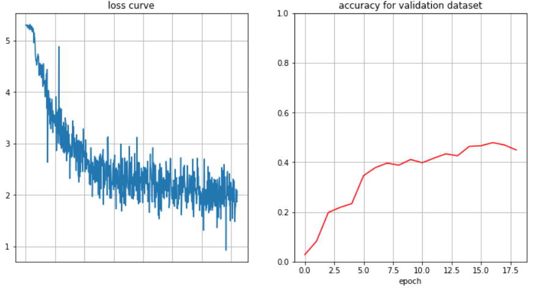
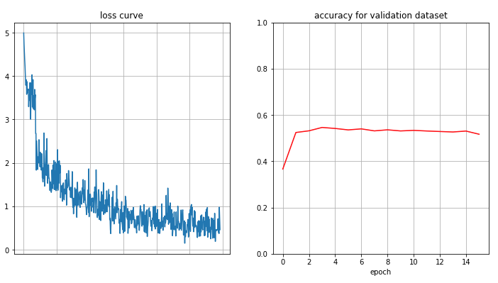
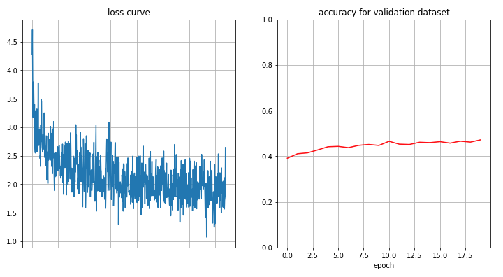
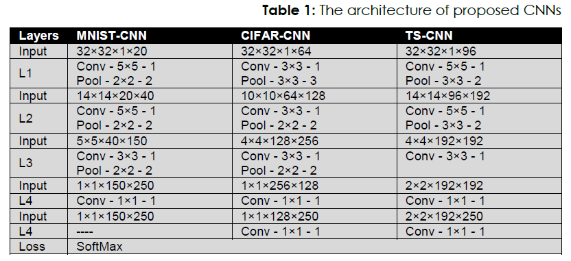
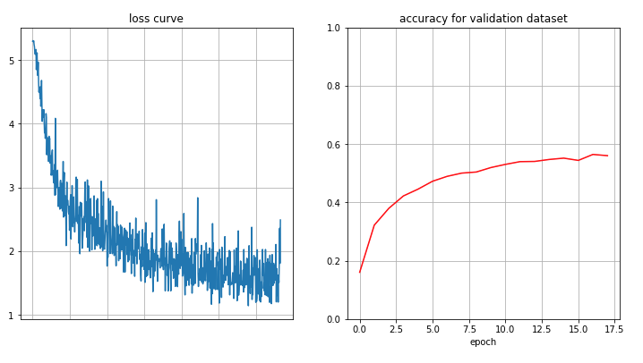
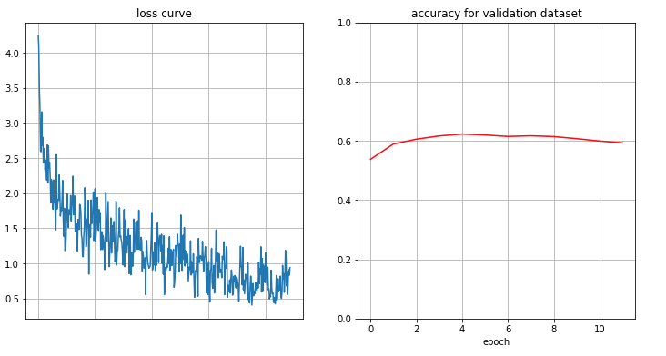
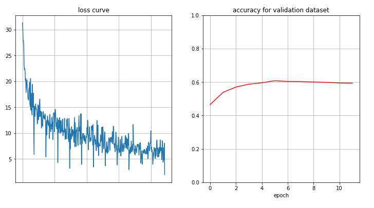
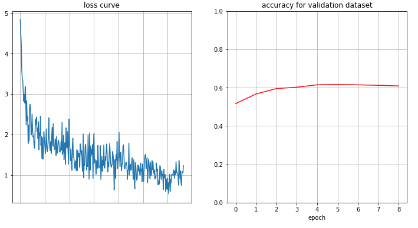
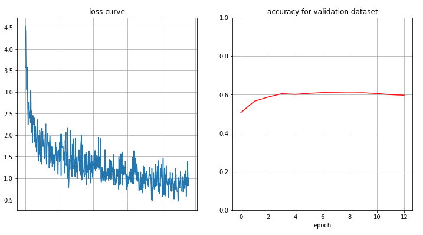

# TinyQuickdraw Classification

---

# Abstract

* Goal: Find the best model which makes best accuracy of test dataset
* Dataset: QuickDraw Sketches(https://www.kaggle.com/google/tinyquickdraw)

# Summary

|                              | loss function | optimizer | val_acc    |
| ---------------------------- | ------------- | --------- | ---------- |
| 1. Baseline                  | CEL           | SGD       | 0.4788     |
| 2. VGG16_bn(pre)             | CEL           | Adam      | 0.5461     |
| 3. ResNet50(pre)             | CEL           | Adam      | 0.4719     |
| 4. TS_CNN                    | CEL           | SGD       | 0.5644     |
| 5. Like_VGG                  | CEL           | Adam      | 0.6230     |
| 6. Like_VGG(with Focal Loss) | Focal Loss    | Adam      | 0.6079     |
| 7. Like_VGG(with RMSprop)    | CEL           | RMSprop   | 0.6163     |
| **8. Like_VGG(with AdamW)**  | **CEL**       | **AdamW** | **0.6267** |
| 9. AI_Inno_CNN               | CEL           | Adam      | 0.6100     |

# Experiments

* Note1: To use just 200 classes because of capacity problem
* Note2: To use a random collection of 1/100 of the original number of images in the class
* Environment: Kaggle GPU, Google Colab Pro
* Model Evaluation Criterion: Best val_cost among epochs
* EarlyStopping: patience=7, comparison val_acc by epoch


## 1. Baseline

```python
    def __init__(self):
        super().__init__()
        self.num_classes = 200
        self.conv_layer = nn.Sequential(
            nn.Conv2d(1, 6, 5, 1),
            nn.ReLU(),
            nn.MaxPool2d(2),
            nn.Conv2d(6, 16, 5, 1),
            nn.ReLU(),
            nn.MaxPool2d(2)
        )
        
        self.fc_layer = nn.Sequential(
            nn.Linear(16*4*4, 256),
            nn.ReLU(),
            nn.Linear(256, self.num_classes),
        )
        
    def forward(self, x):
        x = self.conv_layer(x)
        x = x.view(x.shape[0], -1)
        x = self.fc_layer(x)
        return x
```

* SGD(lr=0.01)
* CrossEntropyLoss
* epochs=10, batch_size=64



```
Best val accuracy of this model is 0.4788 in 17 epoch
```

먼저 Baseline 모델의 성능을 확인했다. 위와 같이 0.4788 정도의 accuracy가 도출된다.


## 2. VGG16_bn(pretrained)

```python
vgg16_bn = torchvision.models.vgg16_bn(pretrained=True).cuda()

for param in vgg16_bn.parameters():
    param.requires_grad = False
    
num_ftrs = vgg16_bn.classifier[6].in_features
vgg16_bn.classifier[6] = nn.Linear(num_ftrs, num_classes)

for param in vgg16_bn.classifier.parameters():
    param.requires_grad = True
```

* Adam(lr=0.001)
* CrossEntropyLoss
* epoch=100, batch_size=64



```
Best val accuracy of this model is 0.5461 in 4 epoch
```

모델링을 하기 전에 Image Classification의 유명한 모델을 transfer learning하여 좋은 성능을 얻을 수 있는지부터 확인했다. 먼저 VGG16 모델 중에, 각 layer마다 input feature map의 variance를 조절해주는 batch normalization을 포함하고 있는 모델 VGG16_bn을 시도했다. 특히 feature extractor 부분은 freezing 시킨 채, classifier만 학습하도록 하는 fine-tuning 방법을 사용했다. 기대와는 달리 위의 결과처럼 생각보다 모델의 성능이 높지 못했다. 전체 architecture의 weights를 모두 update하는 방법도 있겠지만, 시간이 너무 오래 걸리는 task이기 때문에 시도하지는 않았다.


## 3. ResNet50(pretrained)

```python
resnet50 = torchvision.models.resnet50(pretrained=True).cuda()

for param in resnet50.parameters():
    param.requires_grad = False

num_ftrs = resnet50.fc.in_features
resnet50.fc = nn.Linear(num_ftrs, num_classes)

resnet50.fc.weight.requires_grad = True    # double check
```

* Adam(lr=0.001)
* CrossEntropyLoss
* epoch=100, batch_size=64



```
Best val accuracy of this model is 0.4719 in 20 epoch
```

VGG16에 이어서 Image Classification에서 유명한 모델 중의 하나인 ResNet50 모델을 같은 방식으로 fine tuning을 수행했다. 마찬가지로 좋은 성능을 기대하기는 어려웠다. 이에 대한 원인으로는 pre-trained 모델이 해결했던 문제의 이미지와 해결하고자 하는 문제의 이미지가 사뭇 다르기 때문이라고 생각한다. VGG16이나 ResNet50 같은 경우 ImageNet이라는 Dataset을 통해 pre-train을 했는데, ImageNet은 실제 생활에서 볼 수 있는 이미지들을 모아놓은 데이터셋이라고 할 수 있다. 반면에 현재 해결하고자 하는 문제의 Dataset은 사람의 손으로 간략한 스케치를 한 이미지로써, ImageNet의 이미지와 많이 다른 경우라고 할 수 있다. 따라서 좋은 결과를 기대하기는 어렵다. 만약 이를 보완하기 위한 trial을 생각해보자면, 1) 모델의 전체 layer를 freezing시키지 않고 학습하는 방법 2) 모델의 구조 변형을 가하는 방법 등을 염두할 수 있다.


## 4. TS-CNN

HAND DRAWN SKETCH CLASSIFICATION USING CONVOLUTIONAL NEURAL NETWORKS [link](https://www.semanticscholar.org/paper/HAND-DRAWN-SKETCH-CLASSIFICATION-USING-NEURAL-Atabay/e688a6535dbdd6ce6928bc4eb2978f39628e5302)



```python
class TS_CNN(nn.Module):
    
    def __init__(self):
        super().__init__()
        self.num_classes = 200
            # (B, 1, 32, 32)
        self.L1 = nn.Sequential(
            nn.Conv2d(1, 96, 5, 1),
            # (B, 96, 28, 28)
            nn.ReLU(),
            nn.MaxPool2d(3, stride=2),
            # (B, 96, 14, 14)
        )
        self.L2 = nn.Sequential(
            nn.Conv2d(96, 192, 5, 1),
            # (B, 192, 10, 10)
            nn.ReLU(),
            nn.MaxPool2d(3, stride=2),
            # (B, 192, 4, 4)
        )
        self.L3 = nn.Sequential(
            nn.Conv2d(192, 192, 3, 1),
            # (B, 192, 2, 2)
            nn.ReLU()
        )
        self.L4 = nn.Sequential(
            nn.Conv2d(192, self.num_classes, 1, 1),
            # (B, 200, 2, 2)
            nn.ReLU(),
            nn.Conv2d(self.num_classes, self.num_classes, 1, 1)
            
        )
        # weights initializer
        for m in self.modules():
            if isinstance(m, (nn.Conv2d, nn.Linear)):
               nn.init.kaiming_uniform_(m.weight, nonlinearity='relu')
            elif isinstance(m, (nn.BatchNorm2d, nn.GroupNorm)):
               nn.init.constant_(m.weight, 1)
               nn.init.constant_(m.bias, 0)
        
        
    def forward(self, x):
        x = self.L1(x)
        x = self.L2(x)
        x = self.L3(x)
        x = self.L4(x)
        x = x.view(x.shape[0], -1)
        return x
```

* SGD(lr=0.001, momentum=0.9, weight_decay=0.0005)
* CrossEntropyLoss
* epoch=100, batch_size=64



```
Best val accuracy of this model is 0.5644 in 17 epoch
```

해당 실험은 'Sketch Image Classification' 이라는 keyword로 search를 통해 찾은 논문을 바탕으로 구현한 모델을 시도한 결과이다. 논문에서 언급한 성능 결과에 따라 TS-CNN 모델을 구현하였고, Optimizer와 이에 대한 parameter 또한 논문에 기반하여 설정했다. 실험 결과 논문에서 제시된 수치만큼의 결과를 얻을 수 없었는데, 논문을 좀 더 자세히 읽어서 놓친 부분이나 잘못 구현한 부분을 찾아내는 등의 추가적인 작업이 필요하다.


## 5. Like_VGG

```python
class Like_VGG(nn.Module):
    
    def __init__(self):
        super().__init__()
        self.num_classes = 200
        self.conv_layer = nn.Sequential(
            # (B, 1, 28, 28)
            nn.Conv2d(1, 32, 3, 1),
            # (B, 32, 26, 26)
            nn.BatchNorm2d(32),
            nn.ReLU(),
            nn.Conv2d(32, 32, 3, 1),
            # (B, 32, 24, 24)
            nn.BatchNorm2d(32),
            nn.ReLU(),
            nn.MaxPool2d(2),
            # (B, 32, 12, 12)
            nn.Conv2d(32, 64, 3, 1),
            # (B, 64, 10, 10)
            nn.BatchNorm2d(64),
            nn.ReLU(),
            nn.Conv2d(64, 64, 3, 1),
            # (B, 64, 8, 8)
            nn.BatchNorm2d(64),
            nn.ReLU(),
            nn.MaxPool2d(2),
            # (B, 64, 4, 4)
        )
        
        self.fc_layer = nn.Sequential(
            nn.Linear(64*4*4, 64*4*4),
            nn.ReLU(),
            nn.Linear(64*4*4, self.num_classes),
        )
        
        # weights initializer
        for m in self.modules():
            if isinstance(m, (nn.Conv2d, nn.Linear)):
               nn.init.kaiming_uniform_(m.weight, nonlinearity='relu')
            elif isinstance(m, (nn.BatchNorm2d, nn.GroupNorm)):
               nn.init.constant_(m.weight, 1)
               nn.init.constant_(m.bias, 0)
        
    def forward(self, x):
        x = self.conv_layer(x)
        x = x.view(x.shape[0], -1)
        x = self.fc_layer(x)
        return x
```

* Adam(lr=0.001)
* CrossEntropyLoss
* epoch=100, batch_size=64



```
Best val accuracy of this model is 0.6230 in 5 epoch
```

해당 실험은 특별한 가이드 없이 직접 설계한 모델이다. 3x3 Conv2d 2번과 2x2 MaxPooling이 반복되는 방식은 VGG16에 착안하여 모델링을 수행했고, 이 외에도 Batch Normalization과 Kernel Initiallization을 적용했다. Optimizer는 Deep Learning Vision 분야에서 자주 사용되는 Adam Optimizer를 사용했다. 실험한 모델 중에서 상대적으로 성능이 높은 편이지만, 이를 서비스 모델로 활용하기엔 성능이 턱 없이 부족하다. 이를 보완하기 위한 trial를 생각해보자면, 먼저 모델의 상태를 정확히 파악할 필요가 있다. 해당 상태가 overfitting인지 underfitting인지를 파악하고 모델의 복잡도를 조정해야 할 것이다.


## 6. Like_VGG with Focal Loss

[Focal Loss for Dense Object Detection](https://arxiv.org/abs/1708.02002)<br>
[code reference link](https://www.kaggle.com/c/tgs-salt-identification-challenge/discussion/65938)

```
# Class Imbalanced Problem

Max : snowman --> 2753
Min : bed --> 900
Difference : 1853
```

```python
class FocalLoss(nn.Module):
    def __init__(self, alpha=0.25, gamma=2, logits=True, reduce=True):
        super(FocalLoss, self).__init__()
        self.alpha = alpha
        self.gamma = gamma
        self.logits = logits
        self.reduce = reduce

    def forward(self, inputs, targets):
        y = torch.zeros(targets.shape[0], num_classes)
        y[range(y.shape[0]), targets]=1
        targets = y.cuda()
        if self.logits:
            BCE_loss = F.binary_cross_entropy_with_logits(inputs, targets, reduce=False)
        else:
            BCE_loss = F.binary_cross_entropy(inputs, targets, reduce=False)
        pt = torch.exp(-BCE_loss)
        F_loss = self.alpha * (1-pt)**self.gamma * BCE_loss

        if self.reduce:
            return torch.sum(F_loss)    # to check for changes: mean --> sum
        else:
            return F_loss
```

* Adam(lr=0.001)
* FocalLoss
* epoch=100, batch_size=64



```
Best val accuracy of this model is 0.6079 in 6 epoch
```

해당 실험은 Cross Entropy Loss 대신에 Focal Loss를 적용한 실험이다. 해결하고자 하는 문제의 Dataset을 살펴보면, Class Imbalance Problem을 가지고 있다는 것을 확인할 수 있다. 이는 특정 class에 대해서만 학습의 정확도가 올라가는 문제가 발생한다. 따라서 이전에 YOLO v3의 Class Imbalanced Problem을 해결하기 위해 적용했던 Focal Loss를 해당 문제에 맞게 재구현하여 적용했다. 기대와는 달리 결과는 그리 좋지 못했는데, 이에 대한 원인 또한 분석중이다.


## 7. Like_VGG with RMSprop

```python
Like_VGG = Like_VGG()
optimizer = torch.optim.RMSprop(Like_VGG.parameters(), lr=0.001)
criterion = nn.CrossEntropyLoss()
epochs = 100
```



```
Best val accuracy of this model is 0.6163 in 6 epoch
```

이전까지의 실험 결과 Like_VGG의 성능이 가장 좋았기 때문에, 해당 모델을 대상으로 여러 Optimizer를 적용해가며 모델의 성능을 확인했다. Adam Optimizer를 사용한 5번 실험에 이어, RMSprop Opimizer를 사용했다. 모델의 성능은 소폭 하락했다.


## 8. Like_VGG with AdamW

```python
Like_VGG = Like_VGG()
optimizer = torch.optim.AdamW(Like_VGG.parameters(), lr=0.001, weight_decay=0.01)
criterion = nn.CrossEntropyLoss()
epochs = 100
```


```
Best val accuracy of this model is 0.6267 in 7 epoch
```

이어서 AdamW Optimizer를 적용한 실험이다. 해당 Optimizer는 optimizer에 대한 search를 통해 알게 된 기법인데, 최근 Kaggle에서 좋은 성적을 거둔 유저가 제안했다. 개념적인 부분은 뒤로 하고, pytorch에서 제시하는 defalut hyperparameter를 적용한 결과 모델의 성능이 소폭 상승했다.


## 9. AI Inno CNN

```python
class AI_Inno_CNN(nn.Module):
    
    def __init__(self):
        super().__init__()
        self.num_classes = 200
        self.conv_layer = nn.Sequential(
            # (B, 1, 32, 32)
            nn.Conv2d(1, 32, 3, 1),
            # (B, 32, 30, 30)
            nn.ReLU(),
            nn.Conv2d(32, 64, 3, 1),
            # (B, 64, 28, 28)
            nn.ReLU(),
            nn.BatchNorm2d(64),
            nn.MaxPool2d(2),
            # (B, 64, 14, 14)
            
            nn.Conv2d(64, 64, 3, 1),
            # (B, 64, 12, 12)
            nn.ReLU(),
            nn.Conv2d(64, 128, 3, 1),
            # (B, 128, 10, 10)
            nn.ReLU(),
            nn.BatchNorm2d(128),
            nn.MaxPool2d(2),
            # (B, 128, 5, 5)
            
            nn.Conv2d(128, 256, 3, 1),
            # (B, 256, 3, 3)
            nn.ReLU(),
            nn.BatchNorm2d(256)
        )
        
        self.fc_layer = nn.Sequential(
            # (B, 256)
            nn.Linear(256, self.num_classes),
            # (B, 200)
            nn.ReLU(),
            nn.Linear(self.num_classes, self.num_classes),
            # (B, 200)
        )
        
        # weights initializer
        for m in self.modules():
            if isinstance(m, (nn.Conv2d, nn.Linear)):
               nn.init.kaiming_uniform_(m.weight, nonlinearity='relu')
            elif isinstance(m, (nn.BatchNorm2d, nn.GroupNorm)):
               nn.init.constant_(m.weight, 1)
               nn.init.constant_(m.bias, 0)
        
    def forward(self, x):
        x = self.conv_layer(x)
        x = F.adaptive_avg_pool2d(x, (1,1))
        x = x.view(x.shape[0], -1)
        x = self.fc_layer(x)
        return x
```

* Adam(lr=0.001)
* CrossEntropyLoss
* epoch=100, batch_size=64



```
Best val accuracy of this model is 0.6100 in 7 epoch
```

해당 실험은 기존에 AI Innovation Square 교육을 통해 얻은 인사이트를 바탕으로 설계한 모델로 적용했다. VGG16과 유사한 구조 형태를 띠고 있으며, 교육에서 수행했던 모델은 classifier 부분에 global average pooling이 적용되었다. 하지만 이 구조가 오히려 모델의 성능을 떨어뜨려서 단순히 fully connected layer로 구성하여 모델의 성능을 평가했다.

# Discussion

최종적으로 8번 실험에서 진행한 모델(Like_VGG, optimizer=AdamW)의 성능이 **0.6267**로 가장 높았다. 타 실험에 비해 상대적으로는 높은 수치지만 절대적으로 높다고는 할 수 없으며, 따라서 모델의 성능을 올리기 위해 각 실험에서 얻은 인사이트를 바탕으로 새로운 접근을 시도할 필요가 있다. 이 외에도 실험을 수행하면서 다시 한 번 생각해봐야 할 점들이 많았는데, 그 내용은 아래와 같다.


1. 모델의 재현성 부족<br>
   Session을 restart할때마다 200개의 class를 랜덤 추출하기 때문에, 같은 모델이라도 성능이 다르게 평가될 수 있다.
2. 근거에 의한 모델링 부족<br>
   해당 실험은 pre-trained model, VGG16과 비슷한 모델, AI Innovation Square 교육을 통해 경험한 모델, 논문에 의거한 모델 등에 대하여 실험을 진행했다. 하지만 모델링을 할 때에는 명확한 근거에 의하여 모델링을 하는 것이 중요하며, 특히 문제를 해결할 수 있는 논문에 기반한 모델링이 되어야 할 것이다. 이에 대한 시도가 부족했다.
3. 하이퍼파라미터 튜닝<br>
   Optimizer, Loss Function 등에 사용되는 hyperparameter tuning에 대한 실험이 부족했다. 이러한 실험은 먼저 일반 이상의 성능을 도출하는 모델을 찾은 뒤에, 해당 모델에 대하여 여러 hyperparameter를 tuning하는 것이 효율적이라고 생각한다. 또한 tuning 방법도 마찬가지로 근거에 의하여 진행되어야 할 것이다.
4. 딥러닝 프레임워크 숙지<br>
   Keras를 통해 간편하게 모델링을 하다가 해당 기회를 계기로 Pytorch로 처음 모델 설계 및 실험을 진행했다. Pytorch는 Keras와 달리 제공하지 않는 API가 다소 존재한다. 물론 github 등을 통해 이러한 기법들에 대한 code를 찾을 수 있지만, 기법에 대한 알고리즘을 명확히 이해하고 직접 코딩할 수 있는 능력이 필요함을 느꼈다.
5. Class Imbalanced Problem<br>
   해결하고자 하는 문제의 Dataset은 Class Imbalanced Problem을 가지고 있다. 가장 많은 이미지를 가지고 있는 클래스와 가장 적은 이미지를 가지고 있는 클래스의 이미지 수 차이가 1000개 이상 존재하는데, 이는 학습에 악영향을 끼친다. 해당 실험에서는 이를 Focal Loss를 통해 해결하고자 했지만 좋은 성능이 도출되지는 않았다. 따라서 이를 면밀히 분석할 필요가 있는데, 먼저 클래스 별 정확도를 도출해서 Class Imbalanced Problem이 실제로 존재하는지를 확인해 봐야 하고, 만약 존재한다면 Focal Loss를 알맞게 구현했는지를 확인해 봐야 할 것이다.